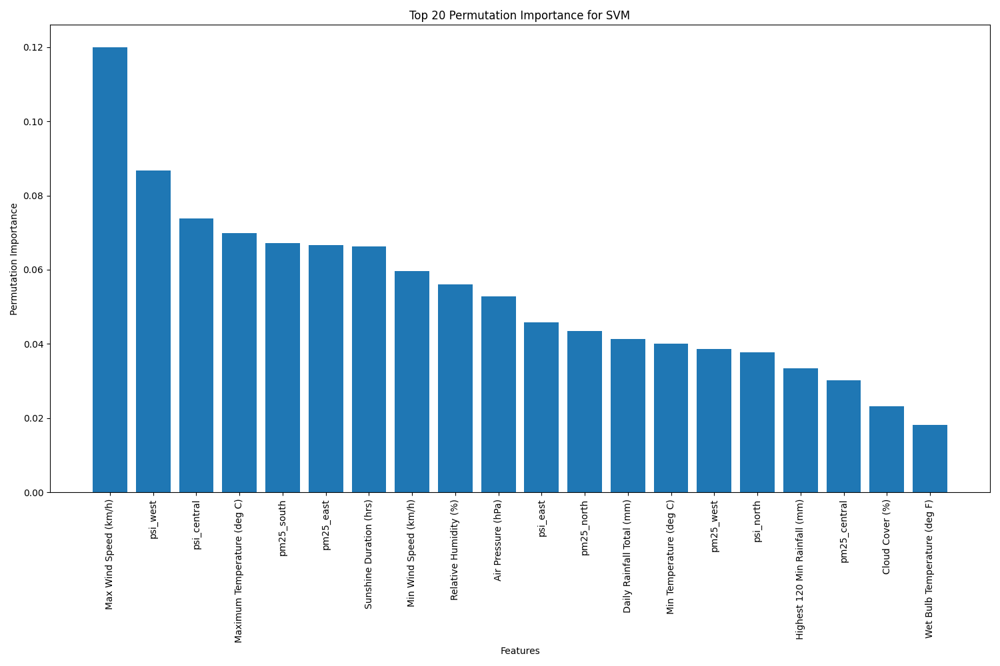

# Solar Panel Efficiency Prediction

This is the assessment for an internship. IYKYK. I am putting this template here in case I ever need to do a similar assessment. If you need, you can use the template also. 

## Project Overview
This project uses weather and air quality data to implement predictive algorithms to learn from patterns associated with varying efficiency levels. The repository contains a notebook `eda.ipynb`, which conducts Exploratory Data Analysis on the given dataset `weather.db` and `air_quality.db`. 

Afterwhich, an end-to-end machine learning pipeline is implemented to
1. Merge the datasets together based on the primary key
2. Clean the merged dataset
3. Preprocess and feed the dataset to 3 machine learning models

Note that there is no hyperparameter tuning on the models because I can't be bothered anymore

## Directory Structure
- `.github`: Scripts to execute end-to-end machine learning pipeline using GitHub Actions
- `data/`: Contains database files
- `results.md`: Results of model training
- `src/`: Source code files
  - `build_model.py`: Preprocess the cleaned data for the machine learning model and run the machine models
  - `data_cleaner.py`: Data cleaning
  - `data_merger.py`: Merge the 2 datasets and remove any duplicates
  - `main.py`: Main execution script
- `eda.ipynb`: Exploratory Data Analysis notebook
- `requirements.txt`: Required Python packages
- `run.sh`: Bash script to run the project
- `References.md` : Contains the references mentioned in the `eda.ipynb`


## Installation & Setup
1. Clone this repository
2. Run the bash script run.sh 
```bash
./run.sh
```

The parts below are typed by the author which I forked from and I am too lazy to edit them. 

## Pipeline Logical Flow

1. Data Ingestion
    - Source data from `weather.db` and `air_quality.db` SQLite databases
    - Use custom `DataIngestion` class to connect and extract data
    - Convert extracted data into pandas DataFrames for further processing

2. Data Preprocessing
    - Handle missing values in numerical columns using mean imputation
    - Clean and standardize categorical data (e.g., wind direction, dew point categories)
    - Remove outliers using the Interquartile Range (IQR) method
    - Encode categorical variables using techniques like one-hot encoding or label encoding
    - Normalize numerical features using StandardScaler to ensure all features are on the same scale

3. Feature Engineering
    - Select the most important features using techniques like correlation analysis and feature importance from tree-based models

4. Model Training
   - Split the preprocessed data into training and testing sets
     - Implement multiple models:
      - Random Forest Classifier
       - Support Vector Machine (SVM)
       - Gradient Boosting (XGBoost)
   - Perform hyperparameter tuning using GridSearchCV with cross-validation
   - Train each model on the training data with the best hyperparameters

5. Model Evaluation
   - Predict solar panel efficiency on the test set using each trained model
   - Calculate and compare performance metrics:
     - Accuracy
     - Precision, Recall, and F1-score for each efficiency class
     - ROC AUC score for multi-class classification
   - Analyze feature importance to understand key predictors of solar panel efficiency
   - Select the best-performing model based on evaluation metrics


## Key EDA Findings

1. **Class Imbalance**
   - Finding: Uneven distribution of efficiency labels (Low, Medium, High)
   - Action: Implemented SMOTENC for balanced class representation

2. **Outlier Detection**
   - Finding: Presence of outliers in the dataset
   - Action: Implemented robust scaling and outlier removal techniques in preprocessing, except for rainfall data since the standard variance is extremely large with extremely skewed data

3. **Missing Data Patterns**
   - Finding: Some features had systematic missing values
   - Action: Developed a custom imputation strategy

4. **No observable temporal patterns**
   - Finding: Does not seem that temporal patterns lead to any distinguishable patterns
   - Action: Remove date from potential features 

## Feature Processing
| Feature Type | Processing Method | Rationale |
|--------------|-------------------|-----------|
| Numerical Features | StandardScaler (optional, determined by GridSearchCV) | Standardization brings all numerical features to the same scale, which is crucial for algorithms like SVM. For tree-based models (Random Forest, XGBoost), I let the hyperparameter tuning decide if scaling improves performance |
| Categorical Features | OneHotEncoder (with `handle_unknown='ignore'`) | One-hot encoding creates binary columns for each category, allowing models to work with categorical data The 'ignore' option handles any unknown categories in future data |
| Target Variable (Daily Solar Panel Efficiency) | LabelEncoder | Converts categorical efficiency labels to numerical values |

### Additional Processing Steps:

1. **Feature Selection**: 
   - Method: SelectKBest with f_classif
   - Rationale: Selects the top 20 most informative features, reducing dimensionality and potentially improving model performance

2. **Handling Imbalanced Data**:
   - Method: SMOTENC (Synthetic Minority Over-sampling Technique for Nominal and Continuous features)
   - Rationale: Addresses class imbalance by creating synthetic examples of the minority classes, helping the model learn to predict all classes effectively

3. **Hyperparameter Tuning**:
   - Method: GridSearchCV with StratifiedKFold cross-validation
   - Rationale: Optimizes model hyperparameters, including preprocessing steps, to find the best combination for each model type

### Feature Importance Analysis:
After model training, I performed feature importance analysis:
- For tree-based models (Random Forest, XGBoost): I used the built-in feature_importances_ attribute
- For other models (e.g., SVM): I used permutation importance

This analysis helps identify which features are most crucial for predicting solar panel efficiency, providing insights for future data collection and model refinement.

## Model Selection

For my solar panel efficiency prediction task, I have selected three diverse machine learning models, each with its own strengths and characteristics. My goal was to compare different approaches and identify the most effective model for the specific problem.

### 1. Model 1: Random Forest
**Rationale for Selection:**
   - Handles non-linear relationships well, which is crucial for complex environmental data
   - Provides feature importance rankings, offering insights into key predictors of solar panel efficiency
   - Relatively robust to outliers and non-scaled features
   - Performs well with both numerical and categorical data
   - Less prone to overfitting due to its ensemble nature

**Hyperparameters Tuned:**
   - `n_estimators`: Number of trees in the forest
   - `max_depth`: Maximum depth of the trees
   - `min_samples_split`: Minimum number of samples required to split an internal node
  - `min_samples_leaf`: Minimum number of samples required to be at a leaf node

### 2. Model 2: Support Vector Machines (SVM)
**Rationale for Selection:**
   - Effective in high-dimensional spaces, which is relevant given the numerous weather and air quality features
   - Often performs well when there's a clear margin of separation between classes
   - Robust against overfitting in high dimensional spaces

**Hyperparameters Tuned:**
   - `C`: Regularization parameter
   - `kernel`: Kernel type to be used in the algorithm
   - `gamma`: Kernel coefficient for 'rbf', 'poly' and 'sigmoid' kernels

### 3. XGBoost Classifier

**Rationale for Selection:**
- Known for its high performance and speed
- Implements regularization, helping to prevent overfitting
- Often outperforms other algorithms in structured/tabular data
- Provides feature importance, similar to Random Forest

**Hyperparameters Tuned:**
- `n_estimators`: Number of gradient boosted trees
- `max_depth`: Maximum tree depth for base learners
- `learning_rate`: Boosting learning rate
- `subsample`: Subsample ratio of the training instance
- `colsample_bytree`: Subsample ratio of columns when constructing each tree

## Model Evaluation

I evaluated three machine learning models for predicting solar panel efficiency: Random Forest, Support Vector Machine (SVM), and XGBoost. Each model was assessed using various metrics to ensure a comprehensive understanding of their performance.

### Performance Metrics

1. **Accuracy**: Overall correctness of predictions across all classes
2. **ROC AUC Score**: Ability to distinguish between classes, accounting for class imbalance
3. **Precision**: Ratio of correct positive predictions to total positive predictions
4. **Recall**: Ratio of correct positive predictions to all actual positives
5. **F1-score**: Harmonic mean of precision and recall

### Results Summary

| Model         | Accuracy | ROC AUC Score | Macro Avg F1-Score |
|---------------|----------|---------------|---------------------|
| Random Forest | 0.8667   | 0.9782        | 0.8671              |
| SVM           | 0.9200   | 0.9788        | 0.9191              |
| XGBoost       | 0.8933   | 0.9839        | 0.8929              |

### Detailed Analysis

1. **Support Vector Machine (SVM)**
   - Best overall performance with the highest accuracy (92.00%) and macro average F1-score (0.9191)
   - Excellent balance between precision and recall across all efficiency classes
   - Particularly strong in identifying 'Low' efficiency cases (90.24% precision, 98.67% recall)

2. **XGBoost**
   - Second-best in accuracy (89.33%) with the highest ROC AUC score (0.9839)
   - Strong performance in 'High' efficiency class (92.75% precision, 85.33% recall)
   - Balanced performance across all classes

3. **Random Forest**
   - Slightly lower overall accuracy (86.67%) but still a high ROC AUC score (0.9782)
   - Strong in identifying 'Low' efficiency cases (89.61% precision, 92.00% recall)
   - Relatively weaker in 'Medium' efficiency class compared to other models

### Class-wise Performance

All models showed varying performance across different efficiency classes (Detailed breakdown in `results/model_results.csv`):

- **High Efficiency**: SVM achieved the best balance (92.11% precision, 93.33% recall)
- **Low Efficiency**: All models performed well, with SVM having the highest F1-score (0.9427)
- **Medium Efficiency**: XGBoost and SVM showed similar performance, with SVM having a slight edge in precision

### Model Selection

While all models demonstrate strong performance, the **Support Vector Machine (SVM)** stands out as the best overall model for this task:

1. Highest accuracy and macro average F1-score
2. Most consistent performance across all efficiency classes
3. Balances precision and recall effectively, crucial for practical application

This is not surprising since SVMs are good at handling large feature dimensionalities, given that I have chosen the top 20 most important features, by making use of kernels.

### Feature Importance Analysis


Upon feature importance analysis using permutation importance for the best-performing SVM model, I have identified the following key features influencing solar panel efficiency:

1. Max Wind Speed (km/h): The most important feature by a significant margin
2. psi_west: The second most important feature, indicating that air quality in the western region significantly impacts efficiency
3. psi_central: Central region air quality is also highly influential, suggesting that air quality, in general, is a key factor
4. Maximum Temperature (deg C): Temperature remains a significant factor affecting panel performance
5. pm25_south: Particulate matter levels in the southern region round out the top five features

This analysis reveals that a combination of weather conditions (wind, temperature) and air quality measures are critical in predicting solar panel efficiency.

## Deployment Considerations
Key factors to consider for model deployment:

### 1. Real-time vs. Batch Predictions
  - **Real-time Predictions:** For immediate efficiency forecasts, optimize the model and infrastructure for low-latency responses
  - **Batch Predictions:** For daily or weekly efficiency planning, set up a batch prediction system that can handle large volumes of data efficiently

### 2. Data Pipeline
  - **Automated Data Collection:** Implement systems to automatically collect and preprocess new weather and air quality data
  - **Data Validation:** Develop robust data validation checks to ensure incoming data meets expected formats and ranges

## Assumptions When Training the Model with Synthetic Data
When developing my solar panel efficiency prediction model, I needed to carefully consider the use of potentially synthetic data. The key assumptions that I'm taking are:

1. Any synthetic features in the dataset maintain the underlying relationships present in real-world data
2. The process of creating synthetic data hasn't accidentally introduced biases that don't exist in real-world scenarios
  
    
